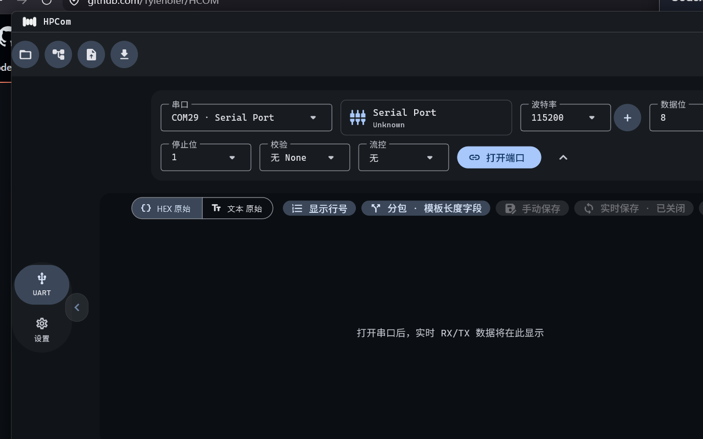
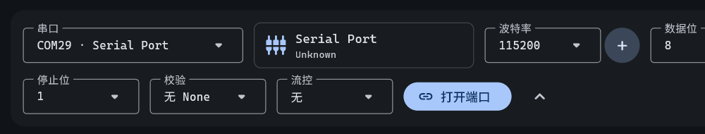
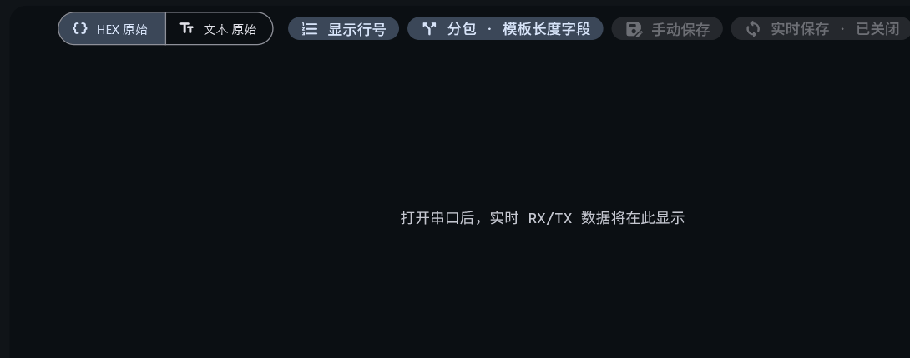

# HPCom / 串口调试助手

<p align="center">
  
</p>

<p align="center">
  <strong>Windows UART / COM workbench for reliable serial communication, live RX/TX inspection, logging, and protocol-frame analysis.</strong><br />
  <strong>面向 Windows 的 UART / COM 调试工作台，提供稳定收发、实时 RX/TX 观察、日志与协议帧分析。</strong>
</p>

<p align="center">
  <a href="#download--下载">Download / 下载</a> ·
  <a href="#quick-start--快速开始">Quick start / 快速开始</a> ·
  <a href="#how-to-use--使用说明">How to use / 使用说明</a> ·
  <a href="#build-from-source--从源码构建">Build / 构建</a>
</p>

> **Current release / 当前版本：v1.0.1**
>
> HPCom is a native Windows desktop tool built with Flutter for the workbench UI and Rust for the serial transport core. HPCom 是一个原生 Windows 桌面工具：Flutter 负责工作台界面，Rust 负责串口传输核心。



## Highlights / 核心能力

| English | 中文 |
|---|---|
| Open and configure physical Windows COM ports. | 打开并配置 Windows 物理串口。 |
| Inspect live RX/TX traffic in HEX or text view. | 以 HEX 或文本方式查看实时 RX/TX 数据。 |
| Configure baud rate, data bits, parity, stop bits, and flow control. | 配置波特率、数据位、校验、停止位与流控。 |
| Send data manually or through the built-in queue and periodic sender. | 手动发送，或使用内置发送队列与周期发送。 |
| Save session data and export logs when required. | 按需保存会话数据并导出日志。 |
| Define protocol frames, validate checksums, and import/export JSON templates. | 定义协议帧、校验校验和，并导入/导出 JSON 模板。 |
| Use a dark, engineering-focused Material 3 workspace with light-theme support. | 使用深色工程化 Material 3 工作台，同时支持浅色主题。 |

## Screenshots / 软件截图

### Connection setup / 连接配置

Select a COM port, configure serial parameters, then open the port. 选择 COM 口、设置串口参数，然后打开端口。



### RX/TX workspace / RX/TX 工作区

The receive workspace can switch between HEX and text, show line numbers, and apply framing/template analysis. 接收工作区可切换 HEX 与文本、显示行号，并应用分包/模板分析。



## Download / 下载

1. Open the [v1.0.0 release](https://github.com/Tylenoler/HPCom/releases/tag/v1.0.1).
2. Download and extract the Windows x64 release archive.
3. Keep every extracted file and folder together; `HPCom.exe`, `hcom-core.exe`, `data/`, and the bundled DLL files are one application package.
4. Run `HPCom.exe`.

1. 打开 [v1.0.0 发布页](https://github.com/Tylenoler/HPCom/releases/tag/v1.0.1)。
2. 下载并解压 Windows x64 发布包。
3. 请保持所有解压后的文件和文件夹在同一目录；`HPCom.exe`、`hcom-core.exe`、`data/` 与随附 DLL 共同组成完整程序。
4. 运行 `HPCom.exe`。

> HPCom v1.0.1 is a portable Windows x64 package; no separate installer is required. HPCom v1.0.1 为免安装 Windows x64 包，无需单独安装程序。

## Quick start / 快速开始

1. Connect your USB-to-UART device or development board to Windows. Connect the device first so its COM port appears in the list. 先将 USB 转串口设备或开发板连接到 Windows，使其 COM 口出现在列表中。
2. In the connection panel, choose the correct **COM port**. 在连接面板选择正确的 **COM 口**。
3. Set the serial parameters to match the target device: **baud rate**, **data bits**, **parity**, **stop bits**, and **flow control**. 按目标设备设置 **波特率**、**数据位**、**校验**、**停止位** 与 **流控**。
4. Click **打开端口 / Open port**. The receive workspace starts showing new RX/TX traffic after the connection succeeds. 点击 **打开端口**；连接成功后，接收工作区会显示新增的 RX/TX 数据。
5. Use the send panel to enter data, select HEX or text as appropriate, and send it to the connected device. 在发送面板输入数据，按需选择 HEX 或文本，再发送到已连接设备。

## How to use / 使用说明

### 1. Receive and inspect traffic / 接收与查看数据

- **HEX 原始 / HEX raw** preserves byte-level visibility and is the recommended view for protocol debugging. 保持字节级可见性，适合协议调试。
- **文本原始 / Text raw** is useful for printable serial output. 适合查看可打印的串口文本。
- **显示行号 / Show line numbers** helps locate long-session records. 便于定位长时间会话中的数据记录。
- RX and TX are labelled independently, so direction is visible while debugging. RX 与 TX 独立标注，便于调试时确认数据方向。

### 2. Send data / 发送数据

Use the send area for a single command, queued commands, or a periodic sequence. For HEX input, separate bytes with spaces when it improves readability (for example: `55 AA 01 00`). Use the configured encoding/text mode for textual commands. 可使用发送区发送单条命令、队列命令或周期序列。HEX 输入可用空格分隔字节（例如 `55 AA 01 00`）；文本命令按已配置的编码/文本模式发送。

### 3. Frame templates and validation / 协议帧模板与校验

Create a frame definition when your data has a known layout: header, length, payload fields, checksum, and trailer. HPCom supports structured field parsing and common integrity calculations, including CRC-16/MODBUS and SUM-8. Definitions can be exported as JSON and imported on another machine. 当数据具有固定布局时，可建立帧定义：帧头、长度、载荷字段、校验与帧尾。HPCom 支持结构化字段解析及常用完整性计算，包括 CRC-16/MODBUS 与 SUM-8；定义可导出为 JSON，并在其他电脑导入。

### 4. Save logs / 保存日志

Use the manual-save or real-time-save actions in the receive toolbar when a trace must be retained. Save logs outside the release folder so upgrading HPCom never mixes program files with captured data. 需要保留通信记录时，使用接收工具栏的手动保存或实时保存。建议把日志保存到发布目录之外，升级 HPCom 时不会混入程序文件。

### 5. Advanced monitor mode / 高级旁路监听模式

The source tree contains virtual-COM relay work. A complete end-user monitor-mode package requires the HCOM VCOM virtual-COM driver (`driver/hcom-vcom/`) approved through Windows kernel signing. That signed driver package is **not included in v1.0.1**, so this release should be used with physical COM ports. 源码中包含虚拟 COM 转发相关工作。完整的用户旁路监听包需要通过 Windows 内核签名审核的 HCOM VCOM 虚拟串口驱动（源码见 `driver/hcom-vcom/`）；该签名驱动 **未包含在 v1.0.1**，因此本版请使用物理 COM 口。

## Requirements / 系统要求

- Windows 10 or Windows 11, 64-bit / Windows 10 或 Windows 11，64 位。
- A working physical serial device and its Windows driver / 可用的物理串口设备及其 Windows 驱动。
- Access permission for the selected COM port / 对所选 COM 口具有访问权限。

## Build from source / 从源码构建

The checked-in sources are intended for Windows development. You need Flutter stable with Windows desktop support and Rust stable. 本仓库源码面向 Windows 开发；需要安装启用了 Windows desktop support 的 Flutter stable 与 Rust stable。

```powershell
git clone https://github.com/Tylenoler/HPCom.git
cd HPCom
.\scripts\bootstrap.ps1 -Build
```

To build a Release package manually / 手动构建 Release：

```powershell
& 'D:\Fluttersdk\flutter\bin\flutter.bat' build windows --release --no-tree-shake-icons
```

The portable output is created under `build\windows\x64\runner\Release\`. 发布产物位于 `build\windows\x64\runner\Release\`。

## Project structure / 项目结构

| Path | Purpose / 用途 |
|---|---|
| `lib/` | Flutter desktop workbench / Flutter 桌面工作台 |
| `core/` | Rust serial transport core / Rust 串口传输核心 |
| `protocol/stdio-ndjson.md` | Flutter–Core IPC contract / Flutter 与 Core 的 IPC 契约 |
| `Image/` | Product logo assets / 产品 Logo 资源 |
| `docs/images/` | README screenshots / README 截图 |
| `scripts/` | Bootstrap and release helpers / 初始化与发布辅助脚本 |

## Validation and release notes / 验证与发布说明

For v1.0.1, the Windows Release package was rebuilt from a clean Flutter build, passed the full test suite and launched successfully; the About dialog reports the in-app version `1.0.1`. v1.0.1 已从干净的 Flutter 构建重新生成 Windows Release，通过完整测试并成功启动；关于页显示应用内版本 `1.0.1`。

This verification does **not** replace acceptance on every USB-UART adapter, device protocol, long-duration soak scenario, or the unavailable signed virtual-COM driver workflow. 本验证 **不等同于** 覆盖所有 USB 转串口适配器、设备协议、长时间稳定性场景，或尚未提供的签名虚拟 COM 驱动流程。

See [CHANGELOG.md](CHANGELOG.md) for version history. 版本历史见 [CHANGELOG.md](CHANGELOG.md)。

## License / 许可证

Licensed under the Apache License 2.0 — see [LICENSE](LICENSE).
本项目采用 Apache License 2.0，详见 [LICENSE](LICENSE)。

## Contributing / 贡献

Issues and pull requests are welcome. Please describe your Windows version, serial adapter/chipset, target baud rate, and reproducible steps when reporting a serial problem. 欢迎提交 Issue 和 Pull Request；报告串口问题时，请说明 Windows 版本、串口适配器/芯片、目标波特率及可复现步骤。
